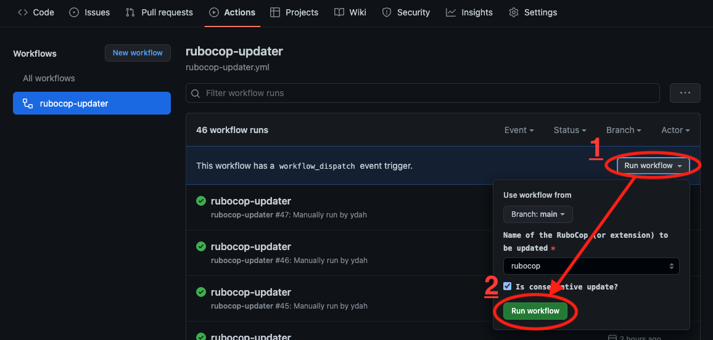

# rubocop-updater

[Custom action](https://docs.github.com/en//actions/creating-actions/about-custom-actions)
to update [RuboCop](https://github.com/rubocop/rubocop) and regenerate `.rubocop_todo.yml`
to exclude all newly added offense cops and create Pull Request.

## How to operate




## Usage

An example workflow to run rubocop-updater via
[manual running](https://docs.github.com/en//actions/managing-workflow-runs/manually-running-a-workflow).

```yaml
# .github/workflows/rubocop-updater.yml
name: rubocop-updater
on:
  workflow_dispatch:
jobs:
  run:
    runs-on: ubuntu-latest
    steps:
      - uses: ydah/rubocop-updater@v0
```

Now you can run rubocop-updater via GitHub Actions page,
or [GitHub CLI](https://cli.github.com/) like this:

```
gh workflow run rubocop-updater
```

## Inputs

### `github_token`

- GitHub access token to run another workflows from new pull request.
    - Don't forget to add `workflow` scope to this token
- optional

### `label`

- Label to be given to the pull request.
- default: `""` (empty string means no-label)

### `mode`

- Switching modes of operation.
  - normal
  - quickly (Do not regenerate `.rubocop_todo.yml` to make it easier to see differences due to version changes)
- default: `normal`

### `update_target`

- RuboCop (or extension) to be updated.
- default: `rubocop`

### `conservative_update`

- If this option is `true`, then bundle update is performed as follows.
    - `bundle update --conservative ${update_target}`
- default: `true`

### `rubocop_options`

- RuboCop client command line options for --auto-gen-config.
- default: `""`

### `another_gemfile`

- Gemfile to be updated at the same time.
  - For example, if multiple Gemfiles are managed, the specified Gemfile is also updated together.
- default: `""` (empty string means only update Gemfile)
